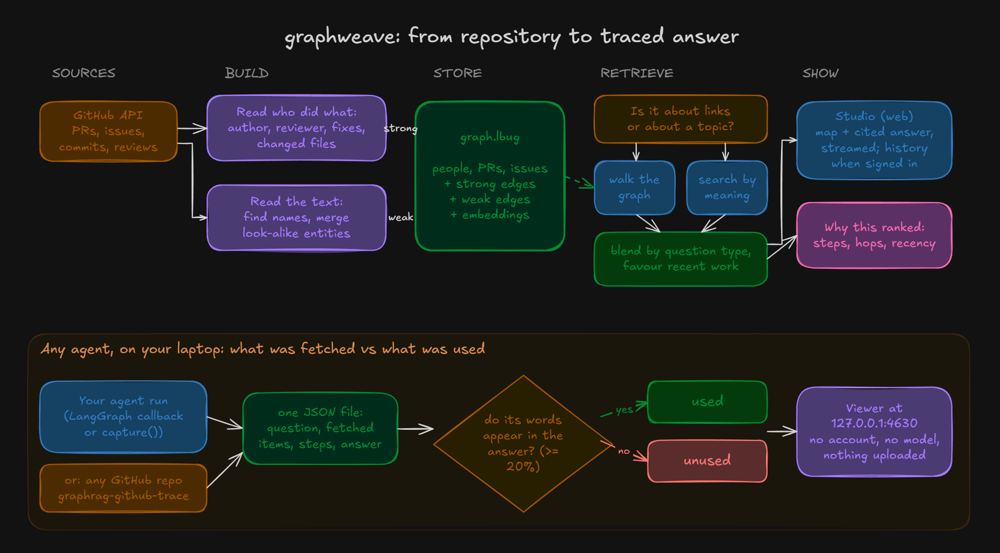

# graphweave

Most of what a retrieval step returns never makes it into the answer. You still pay for all of it: in tokens, in time, and in more places for the model to latch onto the wrong thing. Logs show what was fetched. They don't show what was used.

graphweave shows both. It lays out everything a run retrieved as a map, then checks each item against the final answer and marks it **used** or **unused** by word overlap. No second model grades the evidence, no score is guessed, and nothing leaves your machine.

Point it at any public GitHub repository and ask a question to see it work.



## What you need

- Python 3.12 or newer
- A public GitHub repository, written as `owner/name`

## Get started

```bash
pip install graphweave
graphweave-github-trace psf/requests "What changed in how sessions handle retries?"
graphweave graphweave_out/trace_state.json
```

The first command installs it. The second reads the repository's recent pull requests, issues and commits and saves what matches your question. The third opens the result in your browser at `http://127.0.0.1:4630`.

## In your browser

The map shows the pull requests, issues, commits and people behind the answer and how they connect. Below it, **Retrieved vs used** marks which items the answer actually draws on, then the steps taken and the answer itself. Open a folder instead of a file to switch between saved questions.

## What the numbers mean

| Number | Meaning |
| --- | --- |
| **Combined score** | `(α·vector + β·graph) × recency`; α and β set by question type |
| **Vector similarity** | Cosine similarity between question and item embeddings |
| **Graph relevance** | Best path score from the question's seed nodes: product of edge weights along the path |
| **Recency** | `max(floor, 0.5^(age / half-life))`, with a half-life per entity type; 1.000 = undated or brand new |
| **Age** | Days since the item's event timestamp |

## How links are scored

Each link carries a weight for how much it proves, and a path through the graph scores the product of its links. Links read from GitHub's own records are trusted most; links read out of prose are trusted least.

| Strength | Links | Comes from |
| --- | --- | --- |
| Strongest | `AUTHORED`, `RESOLVES` | who wrote it; "Fixes #N" |
| Strong | `REVIEWED`, `TOUCHES`, `PART_OF` | submitted reviews; changed files; commit to repo |
| Medium | `REPORTED`, `MENTIONS` | who opened the issue; named in the text |
| Weakest | `CO_OCCURS` | names near each other in text (reserved) |

## How duplicates are merged

The same thing gets written many ways: `payment-service`, `payments`, `PaymentService`. Each new name is compared with known ones:

1. **Near-identical:** merged, no model call.
2. **Close but unsure:** one yes/no question to a model. Any timeout, error or unclear reply counts as *different*.
3. **Clearly different:** a new entity.

A merge never renames an entity; only its last-seen time moves forward.

## Repository layout

```
src/
  ingestion/     GitHub API client: PRs, issues, commits, reviews
  analysis/      chunking, entity extraction, duplicate merging
  knowledge/     typed, weighted, timestamped edges
  graphdb/       LadybugDB store: graph + vector index
  retrieval/     question type, graph walk, vector search, fusion, recency
  api/           FastAPI app: trace, answer streaming, history
  tracing/       trace format, capture(), local viewer server
  adapters/      LangGraph callback
  worker/        background ingest and rebuild (hosted mode)
frontend/        React + Vite: Studio and the bundled local viewer
tests/           package and viewer tests
```

## Good questions to ask

- `"Who has been working on the test suite?"`
- `"What changed in how errors are reported?"`
- `"Which pull requests fixed issues about timeouts?"`

## If something goes wrong

| You see | Do this |
| --- | --- |
| A message about GitHub's rate limit | Set a GitHub token in `GITHUB_TOKEN`, or wait an hour |
| The browser doesn't open | Copy the address printed in the terminal into your browser |
| "Address already in use" | Add `--port 4700` |
| `graphweave` is not recognized | Reopen the terminal after installing |
